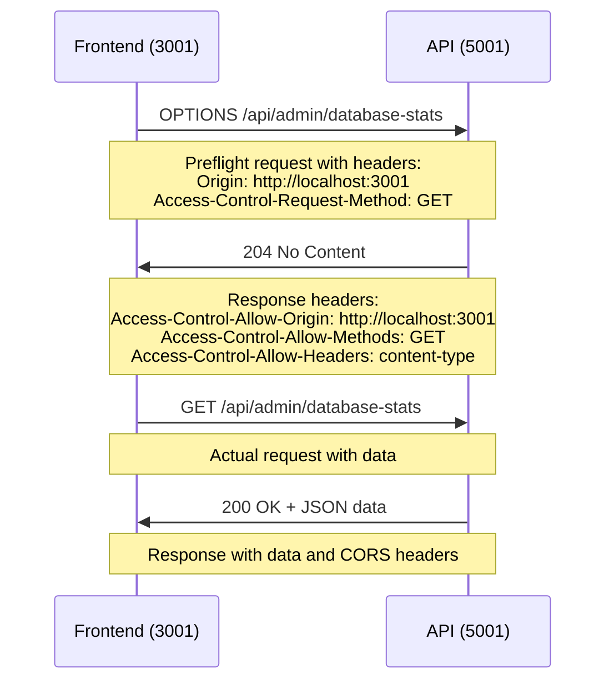

# CORS Configuration Guide

## Overview

This document outlines the Cross-Origin Resource Sharing (CORS) configuration implemented for the Enterprise Documentation Platform. Our CORS setup enables seamless development across multiple ports while maintaining production security standards.

## Problem Statement

Modern web development often requires frontend and backend services running on different ports:
- **Frontend**: React development server on `http://localhost:3001`
- **API**: .NET Core API on `http://localhost:5001`
- **Production**: Both services on same domain with HTTPS

Browser security policies block cross-origin requests by default, requiring explicit CORS configuration.

## Solution Architecture

### Development Configuration

```csharp
// src/core/api/Program.cs
builder.Services.AddCors(options =>
{
    options.AddPolicy("AllowFrontend", policy =>
    {
        // Allow multiple frontend origins for development
        policy.WithOrigins("http://localhost:3000", "http://localhost:3001", "https://localhost:3001")
              .AllowAnyMethod()
              .AllowAnyHeader()
              .AllowCredentials();
    });
});

// Apply CORS policy
app.UseCors("AllowFrontend");
```

### Configuration Breakdown

#### Allowed Origins
- `http://localhost:3000` - Standard React development port
- `http://localhost:3001` - Alternative port (when 3000 is in use)
- `https://localhost:3001` - HTTPS development testing

#### Allowed Methods
- **AllowAnyMethod()** permits: GET, POST, PUT, DELETE, OPTIONS, PATCH
- Supports full RESTful API operations
- Includes preflight OPTIONS requests

#### Allowed Headers
- **AllowAnyHeader()** permits custom headers including:
  - `Content-Type: application/json`
  - `Authorization: Bearer <token>`
  - Custom API headers for enterprise features

#### Credentials Support
- **AllowCredentials()** enables:
  - Cookie-based authentication
  - Bearer token transmission
  - Secure credential handling

## CORS Flow

### Preflight Request Process



### Implementation Details

#### 1. Preflight Handling
Browser automatically sends OPTIONS request for:
- Custom headers (Authorization, Content-Type)
- Methods other than GET, HEAD, POST with simple content types
- Credentials inclusion

#### 2. Response Headers
API includes these headers in responses:
```http
Access-Control-Allow-Origin: http://localhost:3001
Access-Control-Allow-Methods: GET, POST, PUT, DELETE, OPTIONS
Access-Control-Allow-Headers: content-type, authorization
Access-Control-Allow-Credentials: true
Vary: Origin
```

#### 3. Error Handling
Failed CORS requests result in:
```
Access to fetch at 'http://localhost:5001/api/admin/database-stats' 
from origin 'http://localhost:3001' has been blocked by CORS policy
```

## Testing CORS Configuration

### Manual Testing

#### 1. Preflight Request Test
```bash
curl -H "Origin: http://localhost:3001" \
     -H "Access-Control-Request-Method: GET" \
     -H "Access-Control-Request-Headers: content-type" \
     -X OPTIONS \
     http://localhost:5001/api/admin/database-stats \
     -v
```

Expected response:
```http
HTTP/1.1 204 No Content
Access-Control-Allow-Origin: http://localhost:3001
Access-Control-Allow-Methods: GET
Access-Control-Allow-Headers: content-type
Access-Control-Allow-Credentials: true
```

#### 2. Actual Request Test
```bash
curl -H "Origin: http://localhost:3001" \
     -H "Content-Type: application/json" \
     http://localhost:5001/api/admin/database-stats \
     -v
```

Expected response:
```http
HTTP/1.1 200 OK
Access-Control-Allow-Origin: http://localhost:3001
Content-Type: application/json
{JSON data}
```

### Browser Developer Tools

Check Network tab for:
1. **OPTIONS request** with 204 status
2. **Actual request** with 200 status
3. **Response headers** including Access-Control-* headers
4. **No CORS error messages** in console

## Production Configuration

### Security Considerations

For production deployment, implement stricter CORS:

```csharp
// Production CORS configuration
builder.Services.AddCors(options =>
{
    options.AddPolicy("Production", policy =>
    {
        policy.WithOrigins("https://yourdomain.com", "https://app.yourdomain.com")
              .WithMethods("GET", "POST", "PUT", "DELETE")
              .WithHeaders("Content-Type", "Authorization")
              .AllowCredentials();
    });
});
```

### Environment-based Configuration

```csharp
// appsettings.json
{
  "Cors": {
    "AllowedOrigins": [
      "https://spaghetti-platform-drgev.ondigitalocean.app"
    ]
  }
}

// Program.cs
var allowedOrigins = builder.Configuration.GetSection("Cors:AllowedOrigins").Get<string[]>();
builder.Services.AddCors(options =>
{
    options.AddPolicy("ConfiguredPolicy", policy =>
    {
        policy.WithOrigins(allowedOrigins)
              .WithMethods("GET", "POST", "PUT", "DELETE")
              .WithHeaders("Content-Type", "Authorization")
              .AllowCredentials();
    });
});
```

## Common Issues & Solutions

### Issue 1: CORS Policy Execution Failed

**Error Message:**
```
CORS policy execution failed.
Request origin http://localhost:3001 does not have permission to access the resource.
```

**Cause:** Origin not included in allowed origins list

**Solution:** 
1. Verify origin in `WithOrigins()` method
2. Check for typos in URL (http vs https, port numbers)
3. Rebuild API container to pick up changes

### Issue 2: Preflight Request Fails

**Error Message:**
```
Response to preflight request doesn't pass access control check
```

**Cause:** Missing or incorrect preflight handling

**Solution:**
1. Ensure `UseCors()` is called before `UseRouting()`
2. Verify `AllowAnyHeader()` or specific headers are configured
3. Check HTTP method is allowed

### Issue 3: Credentials Not Allowed

**Error Message:**
```
The value of the 'Access-Control-Allow-Credentials' header is '' which must be 'true'
```

**Cause:** Missing `AllowCredentials()` configuration

**Solution:**
```csharp
policy.WithOrigins("http://localhost:3001")
      .AllowCredentials(); // Add this line
```

### Issue 4: Container Changes Not Applied

**Symptom:** CORS configuration changes don't take effect

**Cause:** Docker container using cached code

**Solution:**
```bash
# Rebuild container without cache
docker-compose build api --no-cache
docker-compose up -d api
```

## Debugging Steps

### 1. Verify API Container
```bash
# Check container status
docker-compose ps

# View API logs
docker-compose logs api --tail=20

# Check API is responding
curl http://localhost:5001/api/admin/database-stats
```

### 2. Test CORS Headers
```bash
# Test preflight
curl -H "Origin: http://localhost:3001" \
     -H "Access-Control-Request-Method: GET" \
     -X OPTIONS \
     http://localhost:5001/api/admin/database-stats \
     -I

# Check response headers include Access-Control-Allow-Origin
```

### 3. Frontend Network Analysis
1. Open browser Developer Tools
2. Go to Network tab
3. Refresh frontend page
4. Look for failed requests with CORS errors
5. Check OPTIONS and subsequent requests

## Best Practices

### Development
- **Multiple Origins**: Support common development ports (3000, 3001)
- **Flexible Headers**: Use `AllowAnyHeader()` for development ease
- **Credential Support**: Enable for authentication testing
- **Hot Reload**: Ensure CORS works with development servers

### Production
- **Specific Origins**: Only allow production domain(s)
- **Limited Methods**: Only required HTTP methods
- **Explicit Headers**: List specific headers, avoid `AllowAnyHeader()`
- **HTTPS Only**: Disable HTTP origins in production

### Security
- **Origin Validation**: Never use wildcard (*) with credentials
- **Regular Audits**: Review allowed origins periodically
- **Environment Variables**: Store origins in configuration
- **Monitoring**: Log CORS violations for security analysis

## Integration with Frontend

### API Service Configuration

```typescript
// src/frontend/src/services/api.ts
const API_BASE_URL = import.meta.env['VITE_API_BASE_URL'] || 'http://localhost:5001/api';

async function fetchApi<T>(endpoint: string, options: RequestInit = {}): Promise<T> {
  const url = `${API_BASE_URL}${endpoint}`;
  
  const defaultHeaders: Record<string, string> = {
    'Content-Type': 'application/json',
  };

  // Add auth token - CORS allows credentials
  const token = localStorage.getItem('authToken');
  if (token) {
    defaultHeaders['Authorization'] = `Bearer ${token}`;
  }

  const response = await fetch(url, {
    ...options,
    credentials: 'include', // Important for CORS with credentials
    headers: {
      ...defaultHeaders,
      ...options.headers,
    },
  });

  // Handle CORS errors
  if (!response.ok) {
    throw new ApiError(response.status, `HTTP ${response.status}: ${response.statusText}`);
  }

  return response.json();
}
```

### Error Handling

```typescript
// Handle CORS-specific errors
export class ApiError extends Error {
  constructor(public status: number, message: string) {
    super(message);
    this.name = 'ApiError';
  }
}

// Usage in components
try {
  const data = await api.admin.getDatabaseStats();
} catch (error) {
  if (error instanceof ApiError && error.status === 0) {
    // Likely CORS error
    console.error('Network error - check CORS configuration');
  }
}
```

## Monitoring & Logging

### API Logging

```csharp
// Add CORS logging middleware
app.Use(async (context, next) =>
{
    if (context.Request.Headers.ContainsKey("Origin"))
    {
        var origin = context.Request.Headers["Origin"];
        logger.LogInformation("CORS request from origin: {Origin}", origin);
    }
    
    await next();
});
```

### Production Monitoring

- **CORS Violation Logs**: Monitor failed preflight requests
- **Origin Analysis**: Track request origins for security
- **Performance Impact**: Monitor CORS overhead on response times
- **Error Rates**: Alert on increased CORS-related errors

This CORS configuration enables seamless development while maintaining security best practices for production deployment.