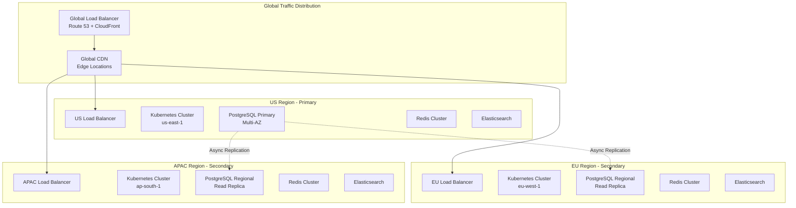
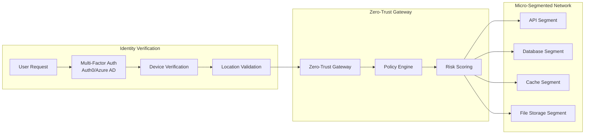
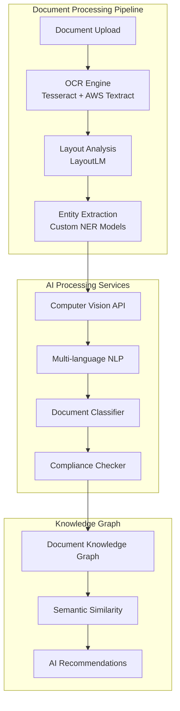
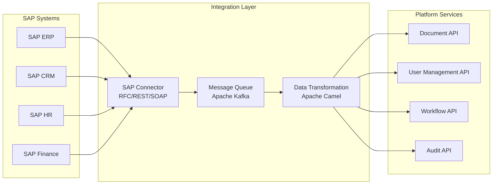
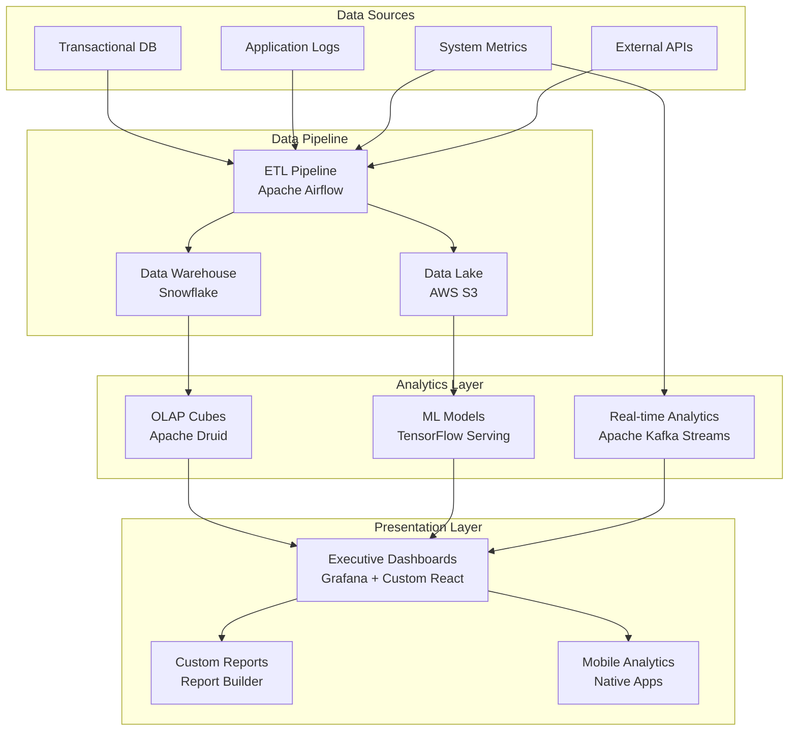
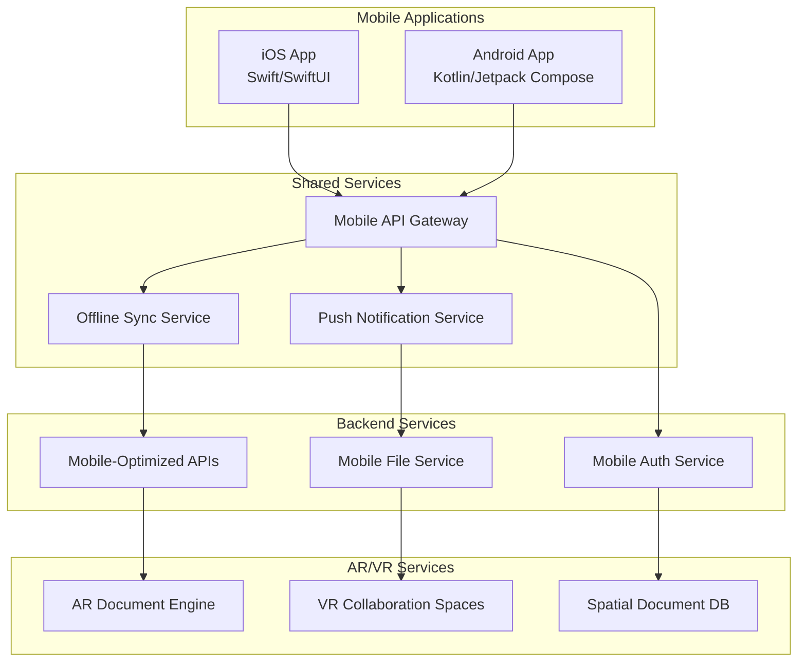
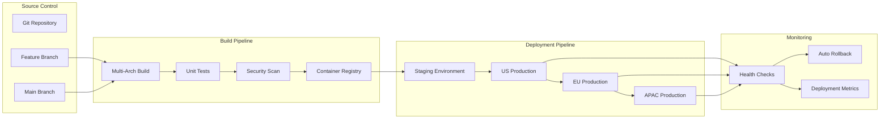

# Sprint 9: Global Multi-Region Architecture Design
## Advanced Enterprise Capabilities & Global Deployment

**Architecture Theme**: "Global Multi-Region with Zero-Trust Security"  
**Target Regions**: US (East/West), EU (West), APAC (South)  
**Performance Goal**: <100ms latency worldwide  
**Security Model**: Zero-trust with AI-powered threat detection  

---

## 🌍 Global Infrastructure Overview

### Multi-Region Deployment Strategy



### Regional Data Distribution

| Region | Primary Services | Data Residency | Latency Target |
|--------|------------------|-----------------|----------------|
| **US East** | All services, Primary DB | US customers only | <50ms |
| **EU West** | All services, Read replica | EU customers only | <75ms |
| **APAC South** | All services, Read replica | APAC customers only | <100ms |

---

## 🔒 Zero-Trust Security Architecture

### Identity and Access Management



### Security Layers Implementation

#### Layer 1: Edge Security
- **Web Application Firewall (WAF)**: CloudFlare with custom rules
- **DDoS Protection**: Multi-layered protection up to 10Gbps
- **Rate Limiting**: Per-user, per-endpoint, per-region limits
- **Geo-blocking**: Configurable country-level restrictions

#### Layer 2: Network Security
- **VPC Isolation**: Separate VPCs per region with encrypted peering
- **Network Segmentation**: Micro-segmented subnets for each service
- **Traffic Encryption**: TLS 1.3 everywhere, internal mTLS
- **Network Monitoring**: Real-time traffic analysis and anomaly detection

#### Layer 3: Application Security
- **API Gateway**: Kong with OAuth 2.0/OIDC integration
- **Service Mesh**: Istio for service-to-service security
- **Container Security**: Pod security policies and admission controllers
- **Secret Management**: HashiCorp Vault for credential rotation

#### Layer 4: Data Security
- **Encryption at Rest**: AES-256 for all data stores
- **Encryption in Transit**: TLS 1.3 for all communications
- **Key Management**: AWS KMS with regional key isolation
- **Data Classification**: Automatic PII detection and protection

---

## 🧠 Advanced AI & Cognitive Services Architecture

### Computer Vision Pipeline



### Multi-Language NLP Engine

| Language | Support Level | Features |
|----------|---------------|----------|
| **English** | Full | All features, legal terminology |
| **Spanish** | Full | Legal docs, regional dialects |
| **French** | Full | European legal compliance |
| **German** | Full | GDPR-specific processing |
| **Japanese** | Advanced | Business documents |
| **Chinese (Simplified)** | Advanced | Contract processing |
| **Portuguese** | Standard | Basic document processing |
| **Italian** | Standard | European legal docs |
| **Dutch** | Standard | EU compliance |
| **Korean** | Standard | Business documents |

---

## 🏢 Enterprise Integration Architecture

### SAP Integration Hub



### Microsoft 365 & Salesforce Integration

#### Microsoft 365 Integration Points
- **Exchange Online**: Email attachment processing
- **SharePoint**: Document synchronization
- **Teams**: Collaboration bridge
- **OneDrive**: Personal document storage
- **Power Platform**: Workflow automation

#### Salesforce Integration Points
- **Sales Cloud**: Opportunity document management
- **Service Cloud**: Case document handling
- **Platform Events**: Real-time notifications
- **Apex REST Services**: Custom API endpoints
- **Lightning Web Components**: Embedded UI

---

## 📊 Advanced Analytics & BI Architecture

### Executive Dashboard Infrastructure



### Predictive Analytics Models

| Model Type | Use Case | Technology | Accuracy Target |
|------------|----------|------------|-----------------|
| **Usage Prediction** | Resource planning | TensorFlow | >90% |
| **Churn Prediction** | Customer retention | XGBoost | >85% |
| **Document Classification** | Auto-categorization | BERT | >95% |
| **Anomaly Detection** | Security threats | Isolation Forest | >99% |
| **Revenue Forecasting** | Business planning | Prophet | >80% |

---

## 📱 Mobile & Cross-Platform Architecture

### Native Mobile App Architecture



### Offline-First Architecture

#### Synchronization Strategy
- **Document Sync**: Differential sync with conflict resolution
- **User Data**: Local SQLite with server reconciliation
- **Media Files**: Progressive download with prioritization
- **Settings**: Immediate sync on reconnection

#### Conflict Resolution Rules
1. **Last Writer Wins**: For user preferences
2. **Merge Strategy**: For document comments
3. **Manual Resolution**: For document content
4. **Server Authority**: For permissions and access

---

## 🔧 DevOps & Infrastructure as Code

### Kubernetes Multi-Region Setup

```yaml
# Global Kubernetes Configuration
apiVersion: v1
kind: ConfigMap
metadata:
  name: global-config
data:
  regions: "us-east-1,eu-west-1,ap-south-1"
  primary_region: "us-east-1"
  replication_lag_threshold: "30s"
  failover_threshold: "5m"
  
---
apiVersion: apps/v1
kind: Deployment
metadata:
  name: spaghetti-platform-global
spec:
  replicas: 3
  strategy:
    type: RollingUpdate
    rollingUpdate:
      maxSurge: 1
      maxUnavailable: 0
  template:
    spec:
      containers:
      - name: api
        image: spaghetti-platform:sprint9
        resources:
          requests:
            memory: "512Mi"
            cpu: "250m"
          limits:
            memory: "1Gi"
            cpu: "500m"
        env:
        - name: REGION
          valueFrom:
            fieldRef:
              fieldPath: metadata.labels['topology.kubernetes.io/region']
```

### CI/CD Pipeline for Global Deployment



---

## 📈 Performance & Scalability Targets

### Global Performance Requirements

| Metric | US Region | EU Region | APAC Region | Global |
|--------|-----------|-----------|-------------|--------|
| **API Response Time** | <50ms | <75ms | <100ms | <100ms |
| **Database Query Time** | <20ms | <30ms | <40ms | <40ms |
| **File Upload Speed** | >10MB/s | >8MB/s | >5MB/s | >5MB/s |
| **Search Response** | <100ms | <150ms | <200ms | <200ms |
| **Dashboard Load Time** | <1s | <1.5s | <2s | <2s |

### Auto-Scaling Configuration

```yaml
apiVersion: autoscaling/v2
kind: HorizontalPodAutoscaler
metadata:
  name: spaghetti-platform-hpa
spec:
  scaleTargetRef:
    apiVersion: apps/v1
    kind: Deployment
    name: spaghetti-platform-global
  minReplicas: 3
  maxReplicas: 100
  metrics:
  - type: Resource
    resource:
      name: cpu
      target:
        type: Utilization
        averageUtilization: 70
  - type: Resource
    resource:
      name: memory
      target:
        type: Utilization
        averageUtilization: 80
  behavior:
    scaleUp:
      stabilizationWindowSeconds: 60
      policies:
      - type: Percent
        value: 100
        periodSeconds: 60
    scaleDown:
      stabilizationWindowSeconds: 300
      policies:
      - type: Percent
        value: 10
        periodSeconds: 60
```

---

## 🎯 Implementation Roadmap

### Phase 2.1: Infrastructure Setup (2 days)
- [ ] Multi-region Kubernetes clusters
- [ ] Global load balancer configuration
- [ ] VPC setup with encrypted peering
- [ ] Database replication setup

### Phase 2.2: Security Implementation (2 days)
- [ ] Zero-trust gateway deployment
- [ ] Identity provider integration
- [ ] Network micro-segmentation
- [ ] Encryption key management

### Phase 2.3: Service Deployment (3 days)
- [ ] API gateway configuration
- [ ] Service mesh implementation
- [ ] Monitoring and logging setup
- [ ] CDN optimization

### Phase 2.4: Testing & Validation (1 day)
- [ ] Cross-region connectivity tests
- [ ] Security penetration testing
- [ ] Performance benchmarking
- [ ] Failover scenario testing

---

## ✅ Architecture Validation Checklist

- [x] Multi-region deployment design complete
- [x] Zero-trust security architecture defined
- [x] AI/Cognitive services architecture planned
- [x] Enterprise integration patterns established
- [x] Mobile and cross-platform strategy defined
- [x] Performance targets and scaling plans set
- [x] Infrastructure as Code configurations ready
- [x] CI/CD pipeline for global deployment designed

---

**Document Status**: Phase 2 Complete - Architecture Coordination  
**Next Phase**: Sprint Planning - 170+ Story Point Distribution  
**Updated**: 2025-08-01  
**Version**: 9.2.0